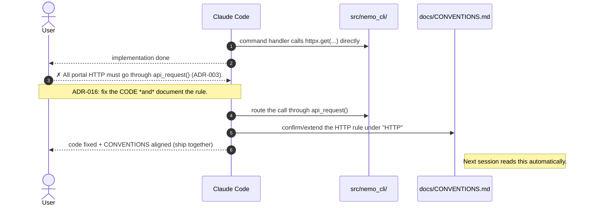
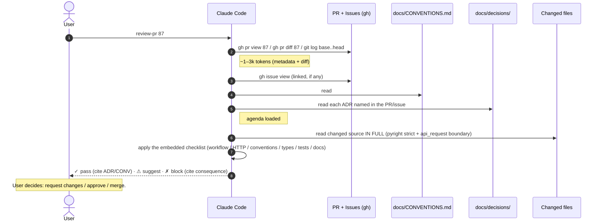

# CFD in motion (nemo-cli)

Sequence diagrams of what a Context-First Development session actually looks
like in this project, message by message. Adapted from the upstream
[CFD `session-flow`](https://github.com/albertomarturelo/context-first-development/blob/main/docs/session-flow.md)
to nemo-cli's real flow: procedures are **Claude Skills** (ADR-015), branching
is **GitHub Flow** (ADR-005), all portal HTTP goes through **`api_request()`**
(ADR-003), and **`docs/CURRENT_STATUS.md` is local-only** (gitignored).

> All diagrams are [Mermaid sequence
> diagrams](https://mermaid.js.org/syntax/sequenceDiagram.html) and render on
> GitHub. Token-cost annotations are approximate.

## Scenario A — Canonical session (happy path)

The vast majority of sessions. `start-session` orients in ~1.5–3k tokens; source
code is read only once a focus is chosen.

```mermaid
sequenceDiagram
    autonumber
    actor U as User
    participant A as Claude Code
    participant DOCS as docs/
    participant ADRs as docs/decisions/
    participant ISS as GitHub Issues (gh)
    participant CODE as src/nemo_cli/

    U->>A: start-session
    A->>DOCS: read CURRENT_STATUS.md (local-only)
    A->>ADRs: read _index.md
    Note right of A: ~500–1.5k tokens
    A->>A: detect in-progress work (e.g. "#N")
    A->>ISS: gh issue view N (if any; ADR-021)
    A->>ADRs: read ADRs listed in the issue
    A-->>U: objective + AC checklist + target paths + pattern to mirror
    Note right of A: total ~1.5–3k tokens. No source scan.

    U->>A: Implement AC item 1.
    A->>CODE: read pattern file (mirror)
    A->>CODE: edit target paths (HTTP via api_request, ADR-003)
    A->>CODE: pytest / ruff / pyright
    A-->>U: report + next-step question

    loop until AC checklist done
        U->>A: next AC item
        A->>CODE: implement + test
        A-->>U: report
    end

    U->>A: close-session
    A->>DOCS: update CURRENT_STATUS.md (local)
    A-->>U: summary suitable for the PR description
    U->>ISS: git push + gh pr create (Closes #N)
```

## Scenario B — Correction surfaces a new convention (ADR-016)

The agent writes code that violates an unstated convention. You don't just fix
the code — you document the convention, in the same change.



## Scenario C — Mid-session decision triggers `new-decision` (ADR-013)

A non-trivial decision surfaces. Instead of just implementing it, the agent
stops and writes the ADR first.

```mermaid
sequenceDiagram
    autonumber
    actor U as User
    participant A as Claude Code
    participant ADRs as docs/decisions/
    participant CODE as src/nemo_cli/

    U->>A: This endpoint is slow — let's just bump the global timeout.

    Note over A: ADR-013: capture the decision first.
    A-->>U: Hold — this changes a convention. Running new-decision.
    A->>U: Problem? Constraints? Why now?
    U-->>A: One endpoint ReadTimeouts at 15s; others are fine.

    A->>ADRs: (decision) override timeout at the service layer, not the global default
    A->>ADRs: update _index.md
    A-->>U: documented. Ready to implement.
    U->>A: Go.
    A->>CODE: pass timeout=... at the call site; add a row to the Timeouts table
```

## Scenario D — PR review against context (ADR-020)

The session opened a PR. Before merge, the diff is reviewed against the
project's indices — not by re-discovering intent from code.



## See also

- [`decisions/_index.md`](decisions/_index.md) — the ADR catalog (013–021 are
  the CFD process ADRs).
- [`CONVENTIONS.md`](CONVENTIONS.md) — the rules the review checklist cites.
- The skills under `.claude/skills/` — `start-session`, `close-session`,
  `new-decision`, `validate-context`, `review-pr`, `issue-new`, `issue-start`.
- Upstream methodology:
  <https://github.com/albertomarturelo/context-first-development>.
